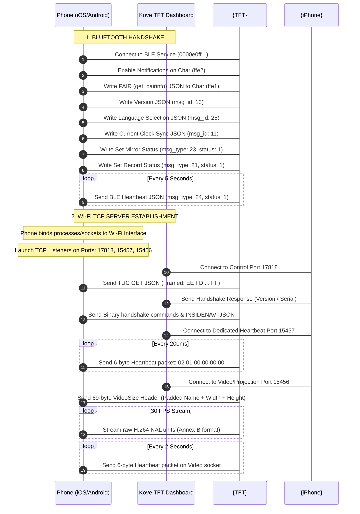

# KoveMirroriOS - iOS Implementation Plan

This document outlines the detailed architecture and step-by-step implementation plan to build **KoveMirror** for iOS, enabling screen mirroring from an iPhone to a Kove 800 motorcycle TFT dashboard (using the ThinkerRide protocol).

---

## 1. How the Android Version Works (Protocol Analysis)

The Android application operates by orchestrating two wireless networks concurrently: **Bluetooth Low Energy (BLE)** and **Wi-Fi**.



### Protocol Details
1. **BLE handshake**: Triggers the dashboard to search for the phone's Wi-Fi network and initiate TCP sockets. If the BLE handshake or its 5-second heartbeat stops, the dashboard terminates the projection session.
2. **Port 17818 (Control)**: The control server must complete a specific sequence of JSON frames and binary sequences.
3. **Port 15457 (Dedicated Heartbeat)**: Requires a strict 200ms interval for the 6-byte keep-alive packet (`0x02, 0x01, 0x00, 0x00, 0x00, 0x00`).
4. **Port 15456 (Video / Projection)**: Streams H.264 video. Starts with a 69-byte header specifying resolutions (usually `600x1024` or `480x800`).

---

## 2. iOS Architectural Mapping

On iOS, we face sandboxing constraints and background execution limits. We must structure the app into two targets:
1. **Main App**: Handles the UI, settings, and the **BLE controller**. Uses `CoreBluetooth` and is kept alive in the background using the **Bluetooth Central** background mode.
2. **Broadcast Upload Extension**: A standard iOS target (`ReplayKit`) that captures the screen in real-time, runs the **TCP Servers**, encodes frames using **VideoToolbox**, and streams them to the motorcycle over Wi-Fi.

| Android Component | iOS Component | Translation Notes |
| :--- | :--- | :--- |
| **MediaProjection API** | **ReplayKit (Broadcast Upload Extension)** | Screen-capture runs in a separate extension process, avoiding background suspension. |
| **MediaCodec (H.264)** | **VideoToolbox (`VTCompressionSession`)** | Hardware H.264 encoder. Outputs AVCC format; must be manually converted to Annex B. |
| **Foreground Service** | **Broadcast Upload Extension Lifecycle** | The extension is kept alive by the iOS system while broadcasting. |
| **Network Utilities** | **Network Framework (`NWListener`, `NWConnection`)** | Modern Apple sockets API. Allows binding specifically to the Wi-Fi interface (`en0`). |
| **BleManager** | **CoreBluetooth (`CBCentralManager`, `CBPeripheral`)** | Needs `bluetooth-central` background mode to remain alive during background mirroring. |

---

## 3. Step-by-Step Implementation Guide

### Phase 1: Set up the Xcode Project
1. Create a new iOS App project called `KoveMirroriOS` (Swift, SwiftUI).
2. Add a new Target: **Broadcast Upload Extension** (e.g. `KoveMirrorUploadExtension`).
3. Enable **App Groups** on both targets to allow shared data storage (for exchanging selected Bluetooth MAC address or settings).
4. Configure Capabilities:
   - **Main App**: Enable `Background Modes` -> Check `Uses Bluetooth LE accessories` (Bluetooth Central).
   - **Main App Info.plist**: Add `NSBluetoothAlwaysUsageDescription` and `NSLocalNetworkUsageDescription` (Local network access is required to listen on TCP ports).

---

### Phase 2: Bluetooth Controller (`BleController.swift`)
Implemented in the **Main App** to handle GATT pairing and keep-alives.

```swift
import Foundation
import CoreBluetooth

class BleController: NSObject, CBCentralManagerDelegate, CBPeripheralDelegate {
    private var centralManager: CBCentralManager!
    private var targetPeripheral: CBPeripheral?
    private var writeCharacteristic: CBCharacteristic?
    
    let serviceUUID = CBUUID(string: "0000e0ff-3c17-d293-8e48-14fe2e4da212")
    let writeCharUUID = CBUUID(string: "0000ffe1-0000-1000-8000-00805f9b34fb")
    let notifyCharUUID = CBUUID(string: "0000ffe2-0000-1000-8000-00805f9b34fb")
    
    private var heartbeatTimer: Timer?
    
    override init() {
        super.init()
        centralManager = CBCentralManager(delegate: self, queue: nil, options: [CBCentralManagerOptionRestoreIdentifierKey: "KoveMirrorRestoreID"])
    }
    
    func centralManagerDidUpdateState(_ central: CBCentralManager) {
        if central.state == .poweredOn {
            // Scan for motorcycle TFT
            centralManager.scanForPeripherals(withServices: [serviceUUID], options: nil)
        }
    }
    
    func centralManager(_ central: CBCentralManager, didDiscover peripheral: CBPeripheral, advertisementData: [String : Any], rssi RSSI: NSNumber) {
        // Connect to the preferred device
        targetPeripheral = peripheral
        centralManager.stopScan()
        centralManager.connect(peripheral, options: nil)
    }
    
    func centralManager(_ central: CBCentralManager, didConnect peripheral: CBPeripheral) {
        peripheral.delegate = self
        peripheral.discoverServices([serviceUUID])
    }
    
    func peripheral(_ peripheral: CBPeripheral, didDiscoverServices error: Error?) {
        guard let service = peripheral.services?.first(where: { $0.uuid == serviceUUID }) else { return }
        peripheral.discoverCharacteristics([writeCharUUID, notifyCharUUID], for: service)
    }
    
    func peripheral(_ peripheral: CBPeripheral, didDiscoverCharacteristicsFor service: CBService, error: Error?) {
        guard let characteristics = service.characteristics else { return }
        for char in characteristics {
            if char.uuid == writeCharUUID {
                writeCharacteristic = char
            } else if char.uuid == notifyCharUUID {
                peripheral.setNotifyValue(true, for: char)
            }
        }
        
        // Characteristic discovered: Complete Handshake
        sendInitHandshake()
        startHeartbeat()
    }
    
    private func sendInitHandshake() {
        let packets: [[String: Any]] = [
            ["msg_id": 27, "func": "PAIR", "act": "get_pairinfo"],
            ["msg_id": 13],
            ["msg_id": 25, "msg_type": 18, "msg_source": 2, "language": 2],
            ["msg_id": 11, "time": getCurrentTimeString(), "tag": -1],
            ["msg_id": 25, "msg_type": 23, "msg_source": 2, "status": 1],
            ["msg_id": 25, "msg_type": 21, "msg_source": 2, "status": 1]
        ]
        
        for p in packets {
            if let data = try? JSONSerialization.data(withJSONObject: p),
               let peripheral = targetPeripheral, let char = writeCharacteristic {
                peripheral.writeValue(data, for: char, type: .withoutResponse)
                Thread.sleep(forTimeInterval: 0.15) // Matching Android's 150ms queue delay
            }
        }
    }
    
    private func startHeartbeat() {
        heartbeatTimer = Timer.scheduledTimer(withTimeInterval: 5.0, repeats: true) { [weak self] _ in
            let hb: [String: Any] = ["msg_id": 25, "msg_type": 24, "msg_source": 2, "status": 1]
            if let data = try? JSONSerialization.data(withJSONObject: hb),
               let self = self, let peripheral = self.targetPeripheral, let char = self.writeCharacteristic {
                peripheral.writeValue(data, for: char, type: .withoutResponse)
            }
        }
    }
    
    private func getCurrentTimeString() -> String {
        let df = DateFormatter()
        df.dateFormat = "yyyy-MM-dd HH:mm:ss"
        return df.string(from: Date())
    }
}
```

---

### Phase 3: Video Compression (`H264Encoder.swift`)
This runs in the **Broadcast Upload Extension** and uses Apple's **VideoToolbox** to encode frames and convert them from AVCC (length-prefixed) to Annex B (start-code-prefixed) format.

```swift
import Foundation
import VideoToolbox

protocol H264EncoderDelegate: AnyObject {
    func encoderDidOutputNALUnit(data: Data)
}

class H264Encoder {
    weak var delegate: H264EncoderDelegate?
    private var session: VTCompressionSession?
    
    func start(width: Int32, height: Int32, fps: Int32) {
        let status = VTCompressionSessionCreate(
            allocator: kCFAllocatorDefault,
            width: width,
            height: height,
            codecType: kCMVideoCodecType_H264,
            encoderSpecification: nil,
            imageBufferAttributes: nil,
            compressedDataAllocator: nil,
            outputCallback: outputCallback,
            refcon: Unmanaged.passUnretained(self).toOpaque(),
            compressionSessionOut: &session
        )
        
        guard status == noErr, let session = session else { return }
        
        // Configure compression properties
        VTSessionSetProperty(session, key: kVTCompressionPropertyKey_RealTime, value: kCFBooleanTrue)
        VTSessionSetProperty(session, key: kVTCompressionPropertyKey_ExpectedFrameRate, value: fps as CFNumber)
        VTSessionSetProperty(session, key: kVTCompressionPropertyKey_MaxKeyFrameInterval, value: fps as CFNumber) // I-frame every 1s
        VTSessionSetProperty(session, key: kVTCompressionPropertyKey_AverageBitRate, value: (width * height * 3) as CFNumber)
        VTSessionSetProperty(session, key: kVTCompressionPropertyKey_ProfileLevel, value: kVTProfileLevel_H264_High_AutoLevel)
        
        VTCompressionSessionPrepareToEncodeFrames(session)
    }
    
    func encode(pixelBuffer: CVPixelBuffer, pts: CMTime) {
        guard let session = session else { return }
        VTCompressionSessionEncodeFrame(session, imageBuffer: pixelBuffer, presentationTimeStamp: pts, duration: .invalid, frameProperties: nil, sourceFrameRefcon: nil, infoFlagsOut: nil)
    }
    
    func stop() {
        if let session = session {
            VTCompressionSessionInvalidate(session)
            self.session = nil
        }
    }
}

// VTCompressionSession Output Callback
private func outputCallback(
    _ refcon: UnsafeMutableRawPointer?,
    _ sourceFrameRefcon: UnsafeMutableRawPointer?,
    _ status: OSStatus,
    _ infoFlags: VTEncodeInfoFlags,
    _ sampleBuffer: CMSampleBuffer?
) {
    guard status == noErr, let sampleBuffer = sampleBuffer, let refcon = refcon else { return }
    let encoder = Unmanaged<H264Encoder>.fromOpaque(refcon).takeUnretainedValue()
    
    guard let formatDescription = CMSampleBufferGetFormatDescription(sampleBuffer) else { return }
    let isKeyFrame = !CFDictionaryContainsKey(unsafeBitCast(CMSampleBufferGetSampleAttachmentsArray(sampleBuffer, createIfNecessary: true), to: CFArray.self), unsafeBitCast(kCMSampleAttachmentKey_NotSync, to: UnsafeRawPointer.self))
    
    // 1. If it's a keyframe, extract and send SPS/PPS first
    if isKeyFrame {
        var parameterSetCount = 0
        CMVideoFormatDescriptionGetH264ParameterSetAtIndex(formatDescription, parameterSetIndex: 0, parameterSetPointerOut: nil, parameterSetSizeOut: nil, parameterSetCountOut: &parameterSetCount, nalUnitHeaderLengthOut: nil)
        
        for i in 0..<parameterSetCount {
            var parameterSetPointer: UnsafePointer<UInt8>?
            var parameterSetSize = 0
            CMVideoFormatDescriptionGetH264ParameterSetAtIndex(formatDescription, parameterSetIndex: i, parameterSetPointerOut: &parameterSetPointer, parameterSetSizeOut: &parameterSetSize, parameterSetCountOut: nil, nalUnitHeaderLengthOut: nil)
            
            if let pointer = parameterSetPointer {
                var header = Data([0x00, 0x00, 0x00, 0x01])
                header.append(pointer, count: parameterSetSize)
                encoder.delegate?.encoderDidOutputNALUnit(data: header)
            }
        }
    }
    
    // 2. Convert AVCC block buffer (length-prefixed) to Annex B (start-code-prefixed)
    guard let blockBuffer = CMSampleBufferGetDataBuffer(sampleBuffer) else { return }
    var bufferLength = 0
    var bufferPointer: UnsafeMutablePointer<Int8>?
    
    CMBlockBufferGetDataPointer(blockBuffer, atOffset: 0, lengthAtOffsetOut: nil, totalLengthOut: &bufferLength, dataPointerOut: &bufferPointer)
    
    if let pointer = bufferPointer {
        var offset = 0
        let startCode = Data([0x00, 0x00, 0x00, 0x01])
        
        while offset < bufferLength - 4 {
            // Read 4-byte length prefix (AVCC)
            var naluLength: UInt32 = 0
            memcpy(&naluLength, pointer.advanced(by: offset), 4)
            naluLength = CFSwapInt32BigToHost(naluLength)
            
            // Extract NAL unit payload and replace length prefix with Annex B start code
            let payloadPointer = pointer.advanced(by: offset + 4)
            var naluData = startCode
            naluData.append(UnsafePointer<UInt8>(OpaquePointer(payloadPointer)), count: Int(naluLength))
            
            encoder.delegate?.encoderDidOutputNALUnit(data: naluData)
            
            offset += 4 + Int(naluLength)
        }
    }
}
```

---

### Phase 4: Sockets and TCP Listeners (`TcpServerManager.swift`)
Using the iOS `Network` framework, this listens on ports `17818`, `15456`, and `15457`.

```swift
import Foundation
import Network

class TcpServerManager {
    private var controlListener: NWListener?
    private var videoListener: NWListener?
    private var heartbeatListener: NWListener?
    
    private var controlConnection: NWConnection?
    private var videoConnection: NWConnection?
    private var heartbeatConnection: NWConnection?
    
    private var heartbeatTimer: Timer?
    private var videoHeartbeatTimer: Timer?
    
    func startServers(width: Int, height: Int, onVideoConnect: @escaping () -> Void) {
        setupControlServer()
        setupHeartbeatServer()
        setupVideoServer(width: width, height: height, onConnect: onVideoConnect)
    }
    
    // ─── Port 17818 (Control Server) ─────────────────────────────────
    private func setupControlServer() {
        controlListener = try? NWListener(using: .tcp, on: 17818)
        controlListener?.newConnectionHandler = { [weak self] connection in
            self?.controlConnection = connection
            connection.start(queue: .main)
            self?.sendTucGet(connection)
            self?.readControlData(connection)
        }
        controlListener?.start(queue: .main)
    }
    
    private func sendTucGet(_ connection: NWConnection) {
        let json = "{\"msg_id\":27,\"func\":\"TUC\",\"act\":\"GET\"}"
        sendFramedJson(connection, json)
    }
    
    private func sendFramedJson(_ connection: NWConnection, _ jsonStr: String) {
        guard let jsonBytes = jsonStr.data(using: .utf8) else { return }
        let len = Int32(jsonBytes.count)
        
        var frame = Data()
        frame.append(0xEE)
        frame.append(0xFD)
        
        var bigEndianLen = len.bigEndian
        frame.append(UnsafeBufferPointer(start: &bigEndianLen, count: 1))
        frame.append(jsonBytes)
        frame.append(0xFF)
        
        connection.send(content: frame, completion: .contentProcessed({ _ in }))
    }
    
    private func readControlData(_ connection: NWConnection) {
        connection.receive(minimumIncompleteLength: 1, maximumLength: 4096) { [weak self] data, _, isComplete, _ in
            guard let data = data, !data.isEmpty else { return }
            
            // Check for initial message from TFT, complete the handshake
            self?.sendControlHandshake(connection)
            
            if !isComplete {
                self?.readControlData(connection)
            }
        }
    }
    
    private func sendControlHandshake(_ connection: NWConnection) {
        // Binary Handshake packets sequence
        let pkts: [Data] = [
            Data([0x01, 0x01, 0x00, 0x00, 0x00, 0x00]),
            Data([0x01, 0x17, 0x00, 0x00, 0x00, 0x04, 0x00, 0x00, 0x00, 0x02]),
            Data([0x01, 0x12, 0x00, 0x00, 0x01, 0x00]) + "yahoo@yahoo.com".data(using: .utf8)!.paddingTo256Bytes(),
            Data([0x01, 0x0E, 0x00, 0x00, 0x00, 0x00]),
            Data([0x01, 0x11, 0x00, 0x00, 0x00, 0x00])
        ]
        for p in pkts {
            connection.send(content: p, completion: .contentProcessed({ _ in }))
        }
        
        sendFramedJson(connection, "{\"msg_id\":27,\"func\":\"INSIDENAVI\",\"query\":2}")
        sendFramedJson(connection, "{\"msg_id\":27,\"func\":\"INSIDENAVI\",\"query\":1}")
    }

    // ─── Port 15457 (Dedicated Heartbeat Server) ─────────────────────
    private func setupHeartbeatServer() {
        heartbeatListener = try? NWListener(using: .tcp, on: 15457)
        heartbeatListener?.newConnectionHandler = { [weak self] connection in
            self?.heartbeatConnection = connection
            connection.start(queue: .main)
            self?.startDedicatedHeartbeat(connection)
        }
        heartbeatListener?.start(queue: .main)
    }
    
    private func startDedicatedHeartbeat(_ connection: NWConnection) {
        let packet = Data([0x02, 0x01, 0x00, 0x00, 0x00, 0x00])
        heartbeatTimer = Timer.scheduledTimer(withTimeInterval: 0.2, repeats: true) { _ in
            connection.send(content: packet, completion: .contentProcessed({ _ in }))
        }
    }
    
    // ─── Port 15456 (Video / Projection Server) ──────────────────────
    private func setupVideoServer(width: Int, height: Int, onConnect: @escaping () -> Void) {
        videoListener = try? NWListener(using: .tcp, on: 15456)
        videoListener?.newConnectionHandler = { [weak self] connection in
            self?.videoConnection = connection
            connection.start(queue: .main)
            
            self?.sendVideoSizeHeader(connection, width: width, height: height)
            self?.startVideoHeartbeat(connection)
            onConnect()
        }
        videoListener?.start(queue: .main)
    }
    
    private func sendVideoSizeHeader(_ connection: NWConnection, width: Int, height: Int) {
        var header = Data(count: 69)
        let nameData = "android".data(using: .utf8)! // Use "android" for max compatibility with TFT firmware
        header.replaceSubrange(1..<1+nameData.count, with: nameData)
        
        var w = UInt16(width).bigEndian
        var h = UInt16(height).bigEndian
        
        header.replaceSubrange(65...66, with: Data(bytes: &w, count: 2))
        header.replaceSubrange(67...68, with: Data(bytes: &h, count: 2))
        
        connection.send(content: header, completion: .contentProcessed({ _ in }))
    }
    
    private func startVideoHeartbeat(_ connection: NWConnection) {
        let packet = Data([0x02, 0x01, 0x00, 0x00, 0x00, 0x00])
        videoHeartbeatTimer = Timer.scheduledTimer(withTimeInterval: 2.0, repeats: true) { _ in
            connection.send(content: packet, completion: .contentProcessed({ _ in }))
        }
    }
    
    func streamVideoFrame(data: Data) {
        videoConnection?.send(content: data, completion: .contentProcessed({ _ in }))
    }
    
    func stop() {
        heartbeatTimer?.invalidate()
        videoHeartbeatTimer?.invalidate()
        
        controlConnection?.cancel()
        videoConnection?.cancel()
        heartbeatConnection?.cancel()
        
        controlListener?.cancel()
        videoListener?.cancel()
        heartbeatListener?.cancel()
    }
}

// Helper Extension for Padding
extension Data {
    func paddingTo256Bytes() -> Data {
        var padded = self
        if padded.count < 256 {
            padded.append(Data(count: 256 - padded.count))
        }
        return padded
    }
}
```

---

### Phase 5: ReplayKit Broadcast Handler (`SampleHandler.swift`)
This handles the stream pipeline inside the Broadcast Extension.

```swift
import ReplayKit

class SampleHandler: RPBroadcastSampleHandler, H264EncoderDelegate {
    private var serverManager = TcpServerManager()
    private var encoder = H264Encoder()
    private var isEncoderStarted = false
    
    let targetWidth = 600
    let targetHeight = 1024
    
    override func broadcastStarted(withSetupInfo setupInfo: [String : NSObject]?) {
        encoder.delegate = self
        
        serverManager.startServers(width: targetWidth, height: targetHeight) { [weak self] in
            guard let self = self else { return }
            self.encoder.start(width: Int32(self.targetWidth), height: Int32(self.targetHeight), fps: 30)
            self.isEncoderStarted = true
        }
    }
    
    override func processSampleBuffer(_ sampleBuffer: CMSampleBuffer, with sampleBufferType: RPSampleBufferType) {
        switch sampleBufferType {
        case .video:
            guard isEncoderStarted, let pixelBuffer = CMSampleBufferGetImageBuffer(sampleBuffer) else { return }
            let pts = CMSampleBufferGetPresentationTimeStamp(sampleBuffer)
            encoder.encode(pixelBuffer: pixelBuffer, pts: pts)
        default:
            break
        }
    }
    
    override func broadcastFinished() {
        encoder.stop()
        serverManager.stop()
    }
    
    // H264EncoderDelegate implementation
    func encoderDidOutputNALUnit(data: Data) {
        serverManager.streamVideoFrame(data: data)
    }
}
```

---

## 4. Key iOS Caveats & Verification Details

1. **Local Network Access Prompt**: On iOS 14+, the system restricts access to local IP routing. During the first TCP listener start, iOS will trigger a "KoveMirror would like to find and connect to devices on your local network" prompt. Make sure `NSLocalNetworkUsageDescription` explains this correctly in the `Info.plist`.
2. **Wi-Fi Interface Binding**: If cell data is active, iOS might route connection sockets through the cellular network instead of Wi-Fi (especially since the motorcycle's hotspot does not provide internet access). We force socket listening on the Wi-Fi card by letting `NWListener` use local interfaces or notifying the user to disable cellular data while mirroring.
3. **VideoSize Identity**: Keep sending `"android"` inside the 69-byte header. Many TFT screens verify the OS string prefix to initialize their internal rendering buffers, and using `"ios"` or `"iphone"` might fail or crash the dashboard.
4. **App Groups Configuration**: The BLE controller runs in the main app, whereas ReplayKit runs in the extension. They can read settings (e.g. padding, resolution) from a shared database like `UserDefaults(suiteName: "group.com.kove.mirror")`.
